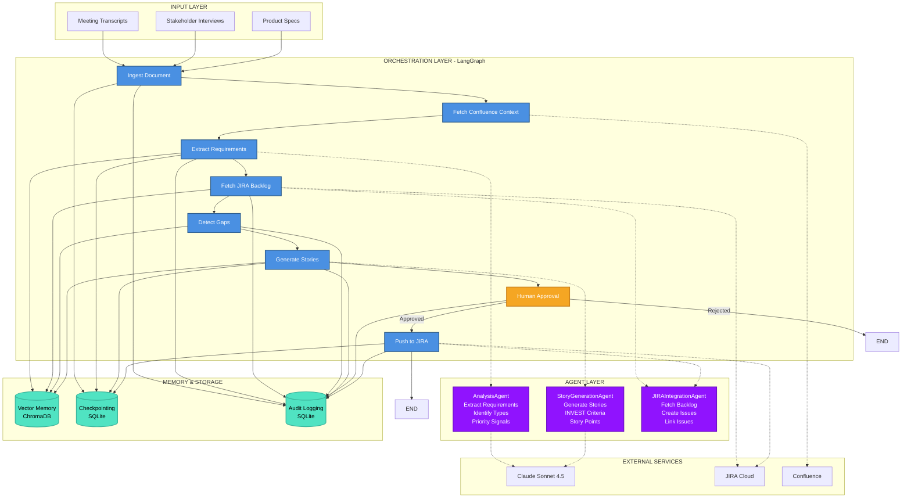
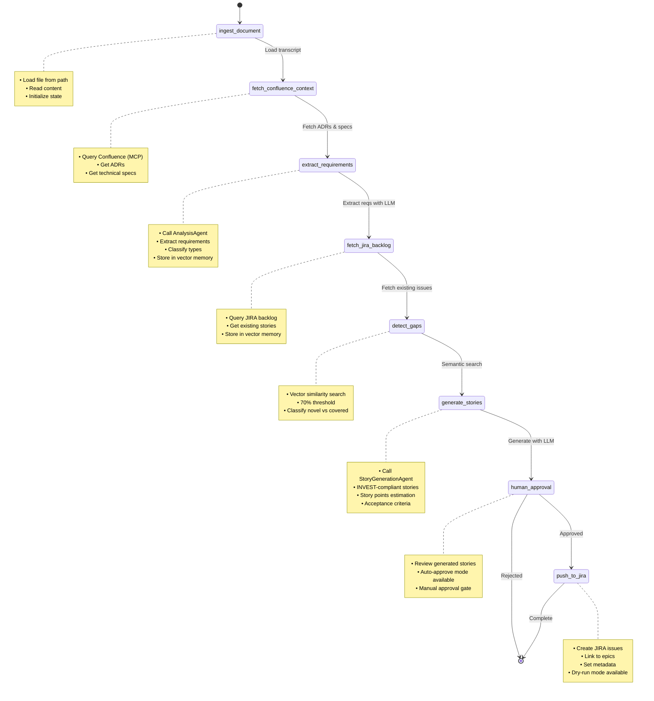
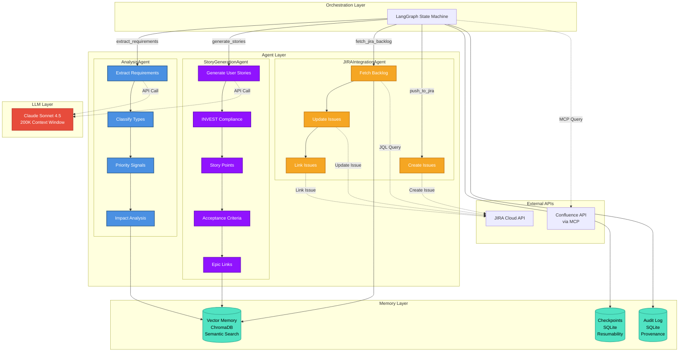
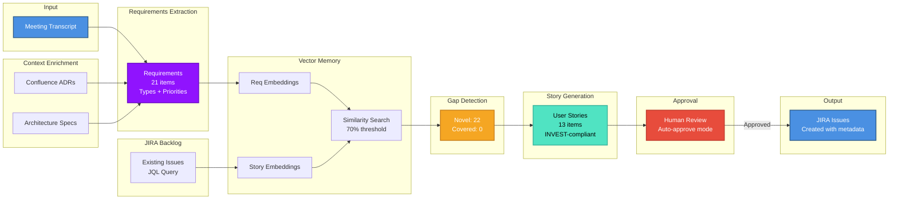
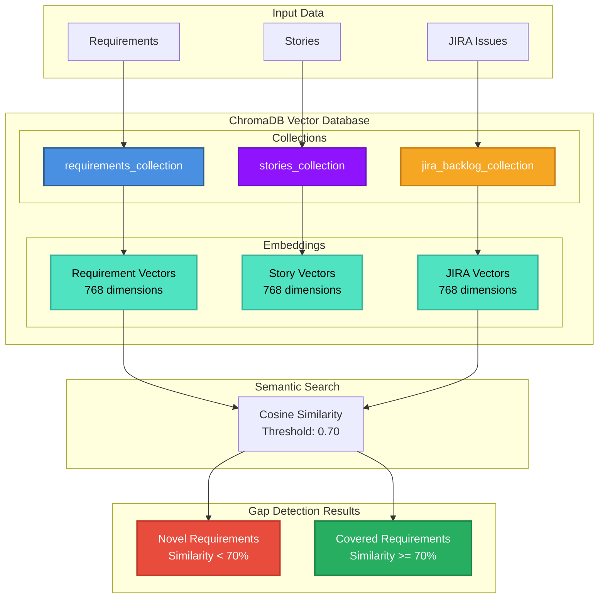
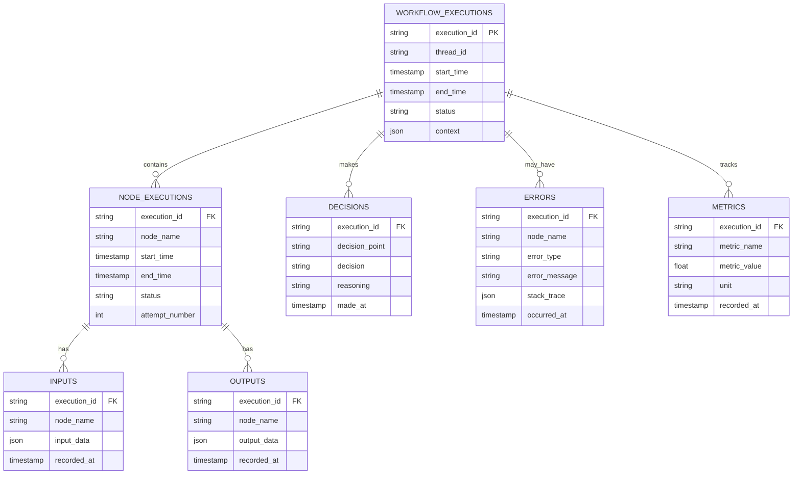

# Backlog Synthesizer Architecture Diagrams

This document contains Mermaid diagrams for the Backlog Synthesizer system architecture.

## System Architecture Overview



## LangGraph Workflow State Machine



## Multi-Agent Architecture



## Data Flow Diagram



## Vector Memory Architecture



## Audit & Provenance System



---

## How to View These Diagrams

### In GitHub
These Mermaid diagrams will render automatically when viewing this file on GitHub.

### In VS Code
Install the "Markdown Preview Mermaid Support" extension:
```bash
code --install-extension bierner.markdown-mermaid
```

### Export to PNG/SVG
Use the Mermaid CLI:
```bash
npm install -g @mermaid-js/mermaid-cli
mmdc -i docs/diagrams.md -o docs/diagrams.png
```

### Online Viewer
Paste the Mermaid code into: https://mermaid.live/

---

## Diagram Maintenance

When updating these diagrams:
1. Keep them synchronized with ARCHITECTURE.md
2. Update node counts if workflow changes
3. Reflect actual implementation details
4. Test rendering before committing
